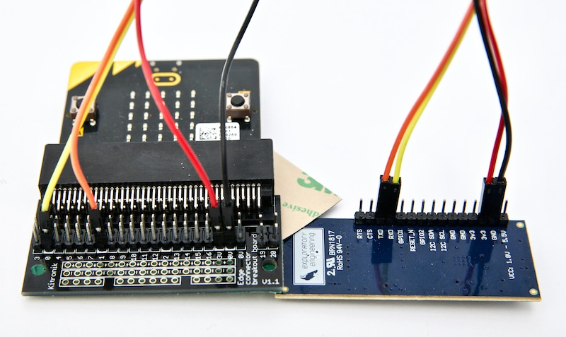

# pxt-nbiot [](https://travis-ci.org/ExploratoryEngineering/pxt-nbiot)

A package to use a Narrowband IoT board with u-blox SARA N2xx with micro:bit. We made this package so the [board we've made](https://shop.exploratory.engineering/collections/nb-iot/products/assembled-ee-nbiot-01-v1-1-breakout-module) can be used with a micro:bit. That board only works with Telenor Norway, but it should be possible to use this with any board that has a u-blox SARA N2 and exposes the RXD and TXD pins. NB-IoT is a technology using the mobile network to send small messages from [anywhere there is 4G coverage that has been upgraded for NB-IoT](https://www.gsma.com/iot/deployment-map/).

The micro:bit needs to be powered by a power source which can handle the u-blox SARA N210, which is minimum 3.1V. So the common 2xAA battery pack won't do (only 3.0V). USB should work fine because it's regulated to 3.3V on the micro:bit.

## Installation

To use this extension, go to [makecode](https://makecode.microbit.org/) and edit or create a new project. Click the gear in the top right corner and «Extensions». Paste in the URL to this github repository: `https://github.com/ExploratoryEngineering/pxt-nbiot` and click on it so add it to the project. You should now see `NB-IoT` in the menu of available blocks.

## Wiring

micro:bit | SARA N210
---------:|----------
P0 | RXD
P1 | TXD
3V (see note above) | VCC
GND | GND

### Example wiring for EE-NBIOT-01
(the 3v3-pin on the EE-NBIOT-01 is actually VCC on the SARA N210)


## Basic usage

```block
// connect to the NB-IoT module on chosen pins (default P0 and P1)
nbiot.connect(SerialPin.P0, SerialPin.P1)

// configure what server to send to
nbiot.setServer("172.16.15.14", 1234)

// run the code when we're successfully connected to the network
nbiot.onConnected(function () {
    basic.showString("Connected")
})

// send number 123
input.onButtonPressed(Button.A, function () {
    nbiot.sendNumber(123)
})

input.onButtonPressed(Button.B, function () {
    nbiot.sendString("Hello")
})
```

## API reference

### connect

Connect to the NB-IoT network using chosen pins to communicate with the SARA-N2 module

```block
nbiot.connect(SerialPin.P0, SerialPin.P1)
```

### imsi

Get the IMSI from the SIM card

```block
nbiot.imsi()
```

### imei

Get the IMEI from the u-blox N2

```block
nbiot.imsi()
```

### set server

Configure server IP address and port. When sending strings or numbers, it will be sent as an UPD message to this IP and port.

```block
nbiot.setServer("172.16.15.14", 1234)
```

### on nbiot connected

Run code when successfully connected to the network

```block
nbiot.onConnected(() => {
})
```

### send string

Send text or number as a string. A socket will be automatically created if needed.

```block
nbiot.sendString("Hello World!")
```

### send number

Send a number. A socket will be automatically created if needed.

```block
nbiot.sendNumber(42)
```

### is connected

Check if we're connected to the network. Returns `true` if connected and `false` if not connected.

```block
nbiot.isConnected()
```

## Advanced API

### send bytes

Send an array as bytes. A socket will be automatically created if needed.

```block
let bytes = [1,2,3]
nbiot.sendBytes(bytes)
```

### send buffer

Send a buffer. A socket will be automatically created if needed.

```block
let length = 5
let buffer = pins.createBuffer(length)
for (let i = 0; i < str.length; i++) {
    buffer.setNumber(NumberFormat.UInt8BE, i, i*2)
}
nbiot.sendBuffer(buffer)
```

### signal strength

Get signal strength in dBm

```block
nbiot.signalStrength()
```

### create socket

Create a socket for sending/receiving data. A socket is automatically created when needed, so usually it's not necessary to create a socket manually.

```block
nbiot.createSocket()
```

### write command

Send raw AT-command to u-blox N2 and wait for OK or ERROR. All communication between the micro:bit and the SARA N2 module is AT commands over a serial connection. Use this function if you want to use some functionality in the SARA N2 which is not implemented in the library. See the [AT Commands Manual](https://www.u-blox.com/sites/default/files/SARA-N2_ATCommands_%28UBX-16014887%29.pdf) for all available commands.

```block
nbiot.writeCommand(`AT+CPSMS=1,,,"11111111","00000000"`)
```

### available lines

Check how many lines we have received that have not been read yet

```block
nbiot.availableLines()
```

### read line

Return the next response line if available, or a blank string if not

```block
nbiot.readLine()
```

### reboot

Reboot the SARA-N2 module

```block
nbiot.reboot()
```

## License

Apache 2.0

## Supported targets

* for PXT/microbit
